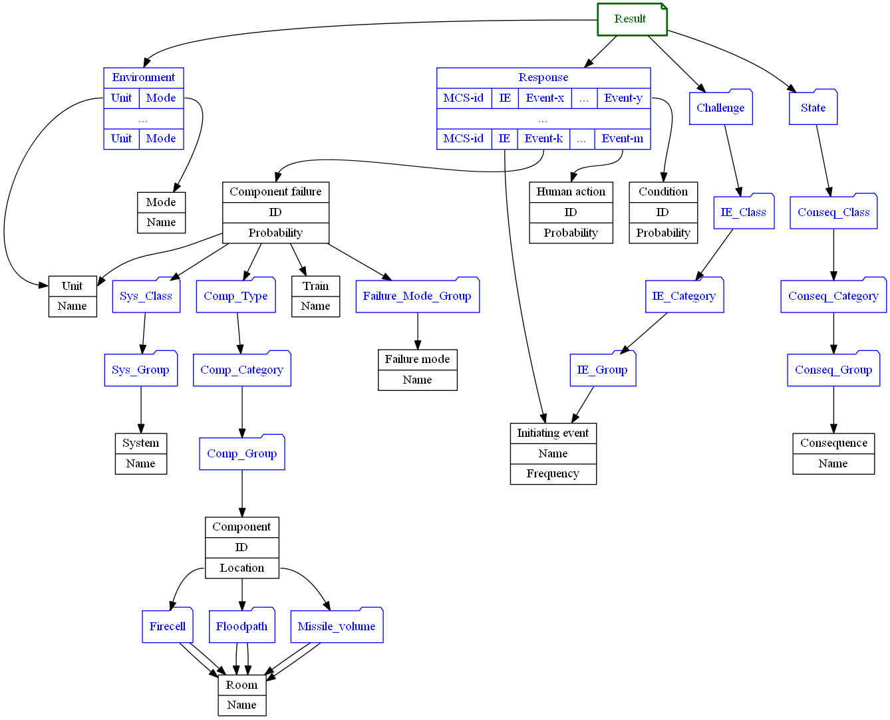

# Exploring PRA results using visualizations

[US Nuclear Regulatory Commission](https://www.nrc.gov) (US NRC) [describes Probabilistic Risk Assessment (PRA)](https://www.nrc.gov/about-nrc/regulatory/risk-informed/pra.html) for a nuclear power plant as a tool for risk estimations by computing likelihood of undesired consequences. The analysis is based on evaluation of what can go wrong, how likely is it, and what are its consequences. Thus, PRA provides insights into the strengths and weaknesses of the design and operation of a nuclear power plant.

PRA can estimate three levels of risk as presented by:

- A *Level 1* PRA estimates the frequency of accidents that cause damage to the nuclear reactor core. This is commonly called core damage frequency (CDF).
- A *Level 2* PRA, which starts with the Level 1 core damage accidents, estimates the frequency of accidents that release radioactivity from the nuclear power plant.
- A *Level 3* PRA, which starts with the Level 2 radioactivity release accidents, estimates the consequences in terms of injury to the public and damage to the environment.

The purpose of this article is to present charts, which can be used as a support for exploration of PRA results. I will use one rule for the charts - they will not be bar charts, which in my opinion are extremely overused in PRA.

## Anatomy of PRA results

Before exploring PRA results, it is important to understand how they are produced and what they represent. Knowing how to select and aggregate PRA results for further analysis will help to uncover hidden knowledge from the results.

As I mentioned before, US NRC [provides a very good description of how PRA is created](https://www.nrc.gov/about-nrc/regulatory/risk-informed/pra.html).

A Level 1 PRA models the various plant responses to an event that challenges plant operation. The plant response paths are called accident sequences. A challenge to plant operation is called an initiating event. There are numerous accident sequences for a given initiating event. The various accident sequences result from whether plant systems operate properly or fail and what actions operators take. Some accident sequences will result in a safe recovery and some will result in reactor core damage.

The frequency for each core damage accident sequence is estimated, and the frequencies for all core damage sequences are summed to calculate the total core damage frequency. In that way, the Level 1 PRA provides the first measure of risk - core damage frequency - which is the input to the Level 2 PRA.

A Level 2 PRA models the plant's response to the Level 1 PRA accident sequences that resulted in reactor core damage. A Level 2 PRA analyzes the progression of an accident by considering how the containment structures and systems respond to the accident, which varies based on the initial status of the structure or system and its ability to withstand the harsh accident environment. Thus, a Level 2 PRA must consider the key phenomena that affect accident progression. Once the containment response is characterized, the amount and type of radioactivity released from the containment can be determined. Thus, the Level 2 PRA estimates the second measure of risk - radioactivity release - which is the input to the Level 3 PRA.

There are only few nuclear power plants in the world who completed their Level 3 PRA, so I stop here and concentrate on exploring results for Level 1 and 2 PRAs.

As you can see from the descriptions, PRA results are combinations of following four parts:

- *environment*, in which some challenge can occur; state of the plant site is a good approximation for that,
- *challenge*, which represents a threat to the plant safety,
- *response* from the plant, which represents operation of required safety functions, and
- *state*, which is an estimated final state for the plant after the challenge has occurred in the environment, and the plant has responded to it in some manner.

The *environment* can be thought of as a list of units affected by the challenge at the plant site coupled with operating mode for the corresponding unit. Operating modes are categorized by utilities, and PRAs use these classifications directly.

The *challenge* is called *an initiating event* (IE) in PRA. Usually, a three-level hierarchy is used to categorize initiating events using classes, categories and groups of initiating events. Transients and Loss Of Coolant Accidents (LOCA) are examples of initiating event classes. Small LOCA of pipe segment X is an example of an initiating event falling into LOCA class, 'small' category and 'pipe segment X' group. The hierarchies used to classify initiating events can differ a lot between different plants, but it is not important for our application. What is important, that there is a classification hierarchy behind initiating events, and therefore we can select and aggregate results based on this hierarchy.

The definition of a *response* is somewhat complicated. The plant can fail to respond to a challenge in many different ways. Each way to fail to respond in a safe manner can be represented by a combination of *events*. Such combinations are called *minimal cutsets* (MCS) in PRA. An *event* is an atomic definition of something failing or working in unexpected ways, and it is coupled with a probability of it happening given the environment and the challenge. There are three types of events considered in PRA - component failures, human errors and *conditions*, which are events left outside the scope of PRA. The major part of events are component failures, and those provide important insight into strengths and weaknesses of the systems. Classification of component failures is built on top of classification of components at the plant combined with classification of failure modes for the components. Classification of components consists of component identification along with classification of component type and information about component's location. Component identification includes unique id coupled with identification of a unit, a system and a train the component belongs to. Such rich information about *events* allows us to select and aggregate probabilities in the *response* in many ways. Some examples of selection and aggregation of events are given below:

- failure to respond, which includes failure to open of at least two motor-operated valves,
- failure to respond, where personnel makes an error during a necessary action,
- failure to respond, where components in a chosen firecell are no longer operational,
- etc.

Classification of end states is done separately for Level 1 PRA estimating core damage risks and for Level 2 PRA estimating risks related to release of radioactivity to the plant environment. Such classifications are usually hierarchies with one to three levels.

The complete picture of the anatomy of PRA results is presented in the following figure.

This anatomy will help us to define aggregations and selections of the PRA results when we will explore those using diagrams.

## Overall picture of risks

Let's start with picture of risks from specific initiating events. To do that, we need to select a *challenge* and a corresponding *environment*. Definition of *risk* will be the *state* on a consequence class level (Conseq_Class in the Anatomy figure), so we will be aggregating the results from lower levels of *state* hierarchy. To get a numerical value for the chosen risk measure, we need to aggregate probabilities from the *response* over all MCS and all events. To present the risks, let's create a scatter plot, where frequency of initiating events will be plot along X-axis, and probability of aggregated failed *response* on Y-axis. For easier interpretation of results, let's also separate initiating event classes by color, and operational modes by shape. The result is presented below.

We can make some interesting conclusions from this plot. First observation is that there is a correlation between frequency of initiating events and probability of failed response to the events. The failure probability for response is higher for less frequent events, and it is lower for more frequent events. This fact reflects a design principle used for nuclear installations - to get risk to reasonably low levels, you need more protection against more frequent *challenges*.

Another important observation is that probability of failed response is highest for the LOCA initiating events. The risk from these events is still acceptable, but only because of low frequency for such events. If frequency of these events would change towards higher values, the risk might exceed acceptable levels.

We can make some observations about model quality as well. For example, probability of failed response to transients during low power modes is extremely low - much lower than the probability of failed response to transients during full power operation. Such conclusion is somewhat counter-intuitive - of course, system requirements are lower compared to full power operation, but it should not lead to such decrease in probability of failed response. This raises a question about quality of modelling and calculations concerning low power mode, and maybe PRA should be updated to reach necessary level of details for these modes of operation.

Can we generalize this picture of overall risks even more? Let's aggregate the results over all operating modes, and treat results for each initiating event class as samples. If we plot the probability distribution over these samples using two variables (IE frequency and barrier), we get the following.

Again, this picture allows us to make some observations. For example, there are two tops for LOCA events - one for medium and large size, and another for small LOCA. The plant response to these events is clearly different (as it should be). Another observation is that the probability of failed response is more or less the same for transients and common cause initiators in secondary systems (CCI-AUX), confirming the sufficient strength of safety functions with regard to diversity and redundancy. Somewhat worrying is that the probability of failed response is lower for common cause initiators in electrical systems (CCI-E) compared to transients. This can be a sign of too optimistic modelling or calculations done for CCI-E.

What if we do the same thing as above, but we aggregate over initiating event classes for different operating modes? We get the following.

Note two tops for full power operation. This is an indication that the response can be divided in two groups: one to the left is for LOCA-like events with the probability of failed response about 1E-4, and another to the right is for transient-like events with the probability of failed response about 1E-6.

A green smudge over red area for shutdown represents transient events under low power operation. Again, you can clearly see that the probability of failed response for these events is inexplicably lower than for comparable events during other operating modes.

## Relations between Level 1 and Level 2 PRA

Can we visualize the relations between risks identified in Level 1 and Level 2 PRA? The overall risk figure we created before is good enough to represent results from Level 1 PRA. A similar scatter plot for Level 2 PRA would be sufficient, but can we add something to indicate relations between PRA levels? We have been using colors to indicate initiating event classes and shapes to indicate operating modes - let's try to use size of the points to indicate ratio between frequency of radioactive release and core damage frequency. The larger the point the higher probability of failed response from containment functions. The results are shown below.

What we can conclude from the plots? In general, containment functions lower the probability of radioactive release by factor 10-100 compared to probability of core damage. This confirms that risks from radioactive release are still acceptable.

What is also interesting, that containment functions provide almost no protection against some of the initiating events presenting highest risks to the plant (see the large points in the second plot) - and you can make this conclusion just by looking at the plot.

## Risks from systems

Now let's try something different. A failed response consists of combinations of events, where some of the events are component failures. Let's try to show systems, components in which dominate the overall risk.

As a measure of system's impact onto risk we can choose it's fractional contribution. The definition of a fractional contribution is rather simple - it is defined as a ratio between aggregated probability of failed response based on all MCS containing failures of components, which belong to the chosen system, and aggregated probability of failed response based on all MCS. One of more obvious solutions to create a bar chart, where fractional contribution can be plot along X-axis while systems are placed along Y-axis. The problem is that, because of large number of systems, the chart is almost unreadable.

To place a lot of data into a limited area, we can use a heatmap. Classifications of systems at most of the Swedish nuclear power plants employ an hierarchy with three levels: system class, category and ordinal number. For example, Emergency Core Cooling System belongs to the class of  safety systems and to the category of 'water supply to reactor vessel'-systems. Therefore, we can create a heatmap for each system class with system categories along Y-axis and system ordinal number along X-axis. Fractional contribution for the corresponding system will be presented using intensity of red color. An example of system risk chart is shown below.

The chart contains a bonus - it is rather easy to see the system coverage in PRA!

## Interactivity

With development of libraries for interactive visualizations such as [Vega-Lite](https://vega.github.io/vega-lite/), it does not take too much effort to create PRA dashboards. The [Vega-Lite](https://vega.github.io/vega-lite/) library supports chart interactions via mouse and keyboard. The analyst can zoom into parts of chart to see the details, get information about specific point using tooltips and select some data points in one chart to see the details for the selection in another.

An example of such PRA dashboard you can find [here](dashboard.html).

## Acknowledgments

This work is using [Vega-Lite](https://vega.github.io/vega-lite/), [Altair](https://altair-viz.github.io/), [Matplotlib](https://matplotlib.org/) and [Seaborn](https://seaborn.pydata.org/) to create visualizations. Data transformations are done using [Python](https://www.python.org/) and [Pandas](https://pandas.pydata.org/).

Many thanks to US Nuclear Regulatory Commission for their excellent description of [PRA](https://www.nrc.gov/about-nrc/regulatory/risk-informed/pra.html).

Note, that PRA results used to create visualizations in this work do not apply to any existing nuclear power plant. The results are reasonably realistic, but they are fake nevertheless. The goal for this article was to show possible visualizations of the results, and not to show the results from a real PRA.